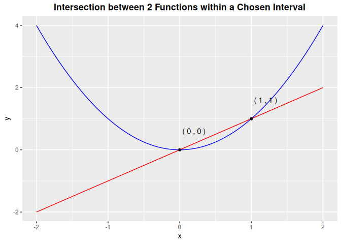

<!-- README.md is generated from README.Rmd. Please edit that file -->

# mathR

<!-- badges: start -->

<!-- badges: end -->

The goal of mathR is to provide convenience functions for basic
algebraic operations including root finding, line-line intersection, and
modular arithmetic for polynomials. All three functions are applied on
polynomials in the real number domain.

## Installation

You can install the development version of mathR from
[GitHub](https://github.com/) with:

``` r
# install.packages("devtools")
devtools::install_github("ADC-405-S26/mathR")
```

## Example

This is a basic example which shows you how to solve a common problem:

``` r
library(mathR)
```

#### root_finding example

``` r
func <- example_data$maxdeg2_func[[1]]
paste0(func[1],"x^2 + ",func[2],"x + ",func[3])
#> [1] "1x^2 + 2x + 1"

root_finding(func[1],func[2],func[3])
#> [1] -1
```

#### line_line_intersection example

``` r
param <- example_data$param_graph
func1 <- paste0(param[1],"x^3 + ",param[2],"x^2 + ",param[3],"x + ",param[4])
func1
#> [1] "0x^3 + 1x^2 + 0x + 0"

func2 <- paste0(param[5],"x^3 + ",param[6],"x^2 + ",param[7],"x + ",param[8])
func2
#> [1] "0x^3 + 0x^2 + 1x + 0"

interval <- param[9]
paste0('(',-interval,',', interval,')')
#> [1] "(-2,2)"

line_line_intersection(param[1],param[2],param[3],param[4],param[5],param[6],param[7],param[8],param[9])
```



#### modular_arithmetic_for_function example

``` r
modular_arithmetic_for_function(example_data$rand_func[[1]],example_data$modular[2])
#> [1] "1*x^3 + 0*x^2 + 1*x^1 + 0*x^0"
```
