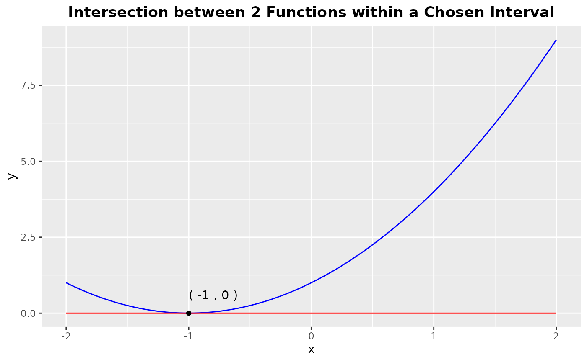

# Introduction to mathR

## Overview

The `mathR` provides convenient functions for some basic algebraic
tasks.

The
[`root_finding()`](https://adc-405-s26.github.io/mathR/reference/root_finding.md)
function is motivated by the quadratic formula in determining the roots
of reducible degree 2 polynomials with one variable. It should
demonstrates the neatness and power of the quadratic formula because
when we get to degree 3 polynomials, finding roots is no longer a simple
task.

The second function,
[`line_line_intersection()`](https://adc-405-s26.github.io/mathR/reference/line_line_intersection.md)
could be said to come out of the first function. As one thinks of the
roots of a function, one can extend that idea to multiple functions. The
intersections between them, if exist, are the roots of the difference
function `(f1(x)-f2(x))`. The package incorporates the `ggplot2` package
which helps create a visualization of polynomial functions with the
`rootSolve` package that can handle root finding for degree 3
polynomials to return a plot of the intersections between two
polynomials inside the user’s interested x-interval. Because line-line
intersection is highly used in Economics, users in this field could find
this function helpful.

Lastly, the
[`modular_arithmetic_for_function()`](https://adc-405-s26.github.io/mathR/reference/modular_arithmetic_for_function.md)
function is motivated by the subject of rings and fields. A core concept
users will encounter in this subject is the abstract idea of categorical
objects: to understand an object, you do not have to look inside it but
rather study its relationship with objects that are already
well-understood. Thus, modular arithmetic provides the tool to travel
from a bigger ring to a smaller one, one which we can understand. On the
subject of polynomials, this function seems fit within the scope of this
package.

## Installation

To install this package from GitHub, use

``` r

# install.packages("remotes")
# install.packages("devtools")
devtools::install_github("ADC-405-S26/mathR")
```

## Load the package

``` r

library(mathR)
```

## Example Dataset and Work Flow

The package contains a dataset and three functions

- `example_data`

We will use this dataset to demonstrate the use of each function in the
package.

``` r

print.data.frame(example_data)
#>   subject_id param_graph modular    rand_func maxdeg2_func
#> 1          1           0       1   1, 2, 3, 4      1, 2, 1
#> 2          2           1       2 0, 2, 9,....      0, 2, 9
#> 3          3           0       3 1, 0, -9, -3     1, 0, -9
#> 4          4           0       4     1, -6, 5     1, -6, 5
#> 5          5           0       5 25, 100,....   25, 100, 1
#> 6          6           0       6 1, -1, -1, 2    1, -1, -1
#> 7          7           1       7     2, 0, -5     2, 0, -5
#> 8          8           0       8 0, 1, 0,....      0, 1, 0
#> 9          9           2       9    5, 2, 0.2    5, 2, 0.2
```

- `root_finding`

This function returns the roots of a polynomial of one variable x whose
maximum degree is 2 and coefficients are in the Real domain.

``` r

# process inputs from the example_data table
vector_param <- example_data$maxdeg2_func[[1]]
vector_param
#> [1] 1 2 1

a <- vector_param[1] # first coefficient
b <- vector_param[2] # second coefficient
c <- vector_param[3] # third coefficient

root_finding(a,b,c)
#> [1] -1
```

- `line_line_intersection`

This function takes two polynomials of one variable x whose maximum
degree is 3 and coefficients are in the Real domain. It returns a graph
of the functions and the coordinates of their intersections within the
user’s specified x-interval.

``` r

# process inputs from the example_data table
param <- example_data$param_graph
func1 <- paste0(param[1],"x^3 + ",param[2],"x^2 + ",param[3],"x + ",param[4])
func1        # first function
#> [1] "0x^3 + 1x^2 + 0x + 0"

func2 <- paste0(param[5],"x^3 + ",param[6],"x^2 + ",param[7],"x + ",param[8])
func2        # second function
#> [1] "0x^3 + 0x^2 + 1x + 0"

interval <- param[9]
paste0('(',-interval,',', interval,')')        # graphing window
#> [1] "(-2,2)"

line_line_intersection(param[1],param[2],param[3],param[4],param[5],param[6],param[7],param[8],param[9])
```


If you just want to visualize a degree 2 polynomial and its root from
the first example (`f(x)= x^2 + 2x + 1` and `x=-1` is the root) here,
you can make the parameters for the second function all zero and start
with a wide interval. If the roots appear close to the origin, you then
zoom into the origin by reducing the size of your interval.

``` r

line_line_intersection(a1=0,a2=1,a3=2,a4=1,
                       b1=0,b2=0,b3=0,b4=0,
                       interval =2)
```



- `modular_arithmetic_for_function`

This function applies modular arithmetic to polynomials whose
coefficients are in the Real domain.

``` r

# process inputs from the example_data table
func_coeff <- example_data$rand_func[[1]]
func_coeff
#> [1] 1 2 3 4

m <- example_data$modular[2]
m
#> [1] 2

modular_arithmetic_for_function(func_coeff,m)
#> [1] "1*x^3 + 0*x^2 + 1*x^1 + 0*x^0"
```
